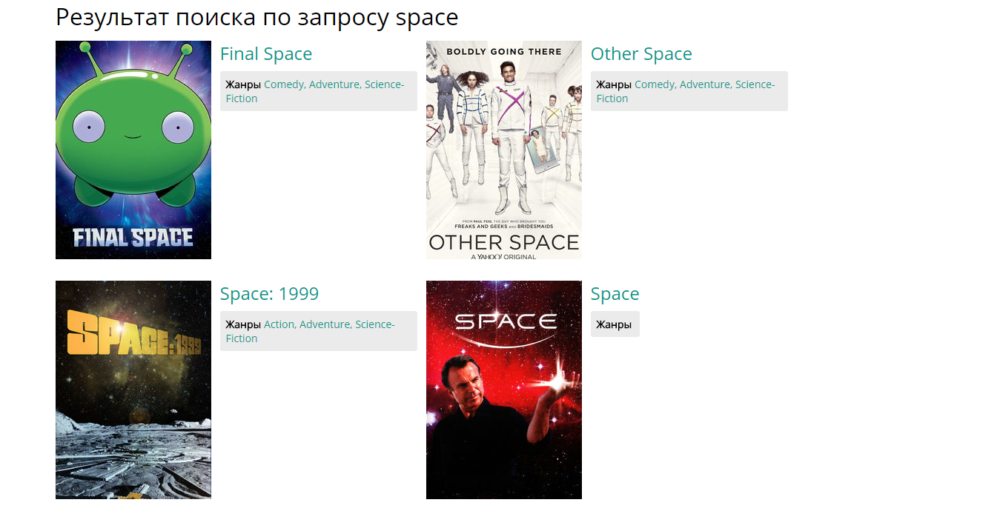
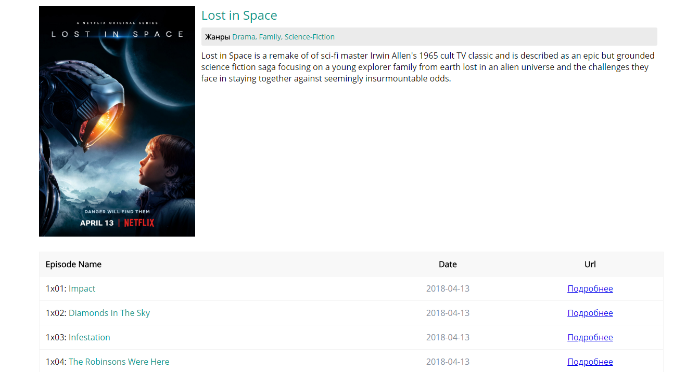

### Задание

Создать простое изоморфное приложение (с использованием SSR, Next.js) для просмотров сериалов состоящее из трех страниц.

#### Первая страница

Поиск. Вводите запрос в поле поиска, после нажатия "enter" или кнопки поиска попадаете на второй страницу.

#### Вторая страница

Cписок сериалов. Здесь отображены список сериалов, который вы получили после отправки запроса. Карточка с сериалом должна содержать изображение, название, жанры.

#### Третья страница

Здесь отображается полный постер сериала и его подробная информация с описанием. Внизу список из сериалов. В элементе списка должны содержаться номер, название, дата выхода эпизода.

Работоспособность в двух последних версиях десктопных браузеров Chrome, Safari, Firefox, Edge.

### API

http://www.tvmaze.com/api

### Необязательные задачи

* Адаптивность.
* Использование линтера/форматера.
* Ленивая подгрузка компонентов или модулей.

### Стек

* redux
* redux-saga
* immutable
* express
* reselect
* styled-components
* eslint

### Скриншоты

#### Страница поиска

#### Страница результата поиска

#### Страница детальной информации

